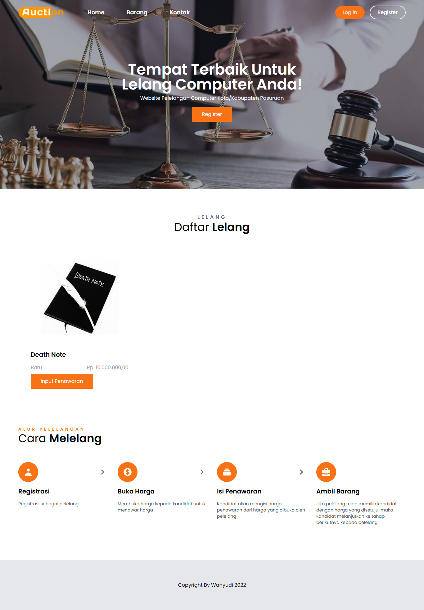
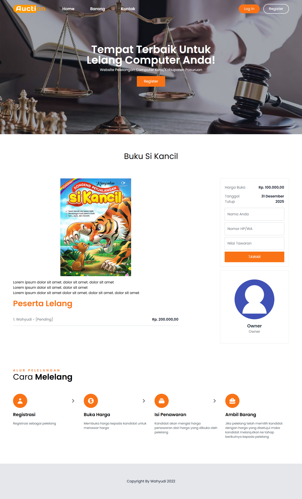
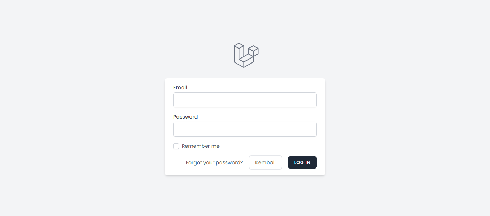
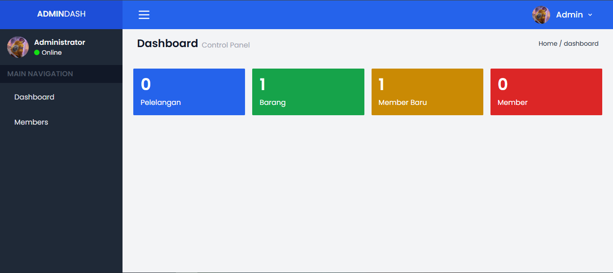
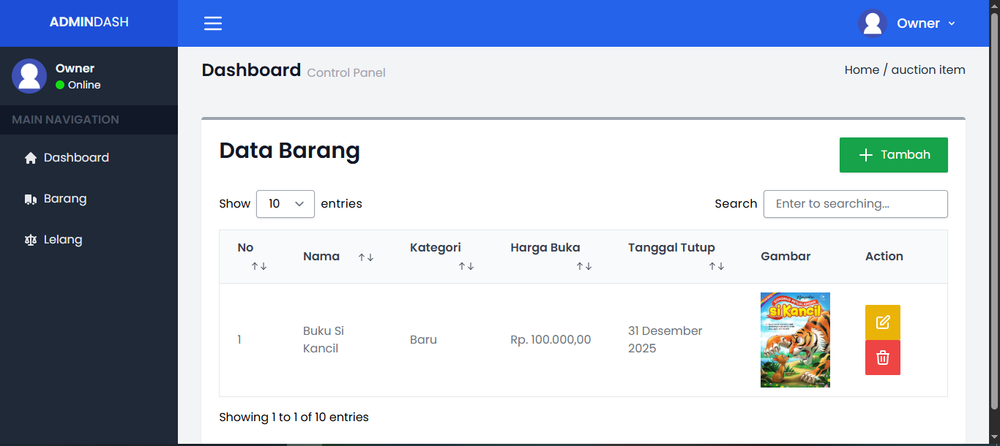
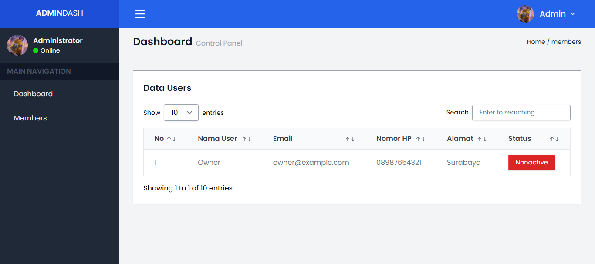
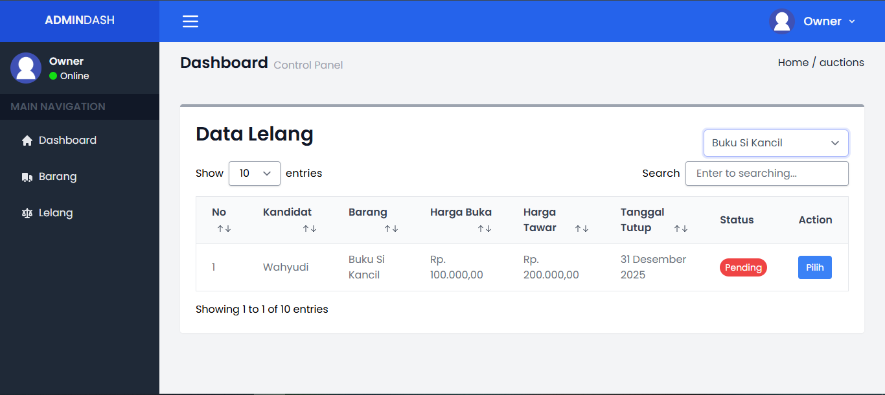

# Aplikasi Lelang Online

Aplikasi Lelang Online menggunakan teknologi Laravel dan Vue.js. Aplikasi ini memiliki 2 role yaitu pelelang dan admin.

## Halaman utama
Halaman utama aplikasi Lelang Online menampilkan daftar barang yang akan dilelang.

# Halaman Penawaran
Halaman untuk menawarkan bid untuk barang yang akan dilelang.

## Halaman Login

## Halaman Dashboard

## Halaman Barang

## Halaman Member (Admin)
Halaman untuk menampilkan dan mengelola daftar member

## Halaman Lelang
Halaman untuk melihat dan memilih pemenang lelang.

